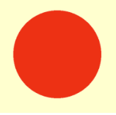

# 渲染

从现在起，代码应该每帧都执行。MTKView 有一个每帧都运行的委托方法，但是当你执行简单的渲染时，它只会填充静态视图，所以你不需要每帧都刷新屏幕。

在执行图形渲染时，GPU 的最终工作是从 3D 场景输出单个纹理。此纹理类似于物理相机创建的数字图像。纹理将每帧显示在设备的屏幕上。

### 渲染通道(Render Passes)

如果你想要实现逼真的渲染，则需要考虑阴影、光照和反射。这些都需要大量计算，并且通常在单独的渲染通道中完成。例如，阴影渲染通道将渲染 3D 模型的整个场景，但仅保留灰度阴影信息。

第二个渲染通道将以全彩色渲染模型。然后，你可以将阴影和颜色纹理组合起来，以生成最终输出到屏幕的纹理。

<figure><figcaption></figcaption></figure>

在本书的第一部分，你将使用单次渲染过程。稍后，你将了解多次渲染。方便的是，`MTKView` 提供了一个渲染过程描述符，它将保存一个称为可绘制对象(Drawable)的纹理。

将此代码添加到 Playground 的末尾：

<pre class="language-swift"><code class="lang-swift">// 1
guard let commandBuffer = commandQueue.makeCommandBuffer(),
// 2
    let renderPassDescriptor = view.currentRenderPassDescriptor,
// 3
    let renderEncoder = commandBuffer.makeRenderCommandEncoder(
        descriptor: renderPassDescriptor)  
<strong>else { 
</strong><strong>    fatalError() 
</strong><strong>}
</strong></code></pre>

以下是正在发生的事情：

1. 你创建一个命令缓冲区。它存储了你将要求 GPU 运行的所有命令。
2. 你获得对视图的渲染过程描述符的引用。描述符保存渲染目标(称为附件，Attachments)的数据。每个附件都需要信息，例如要存储的纹理，以及是否在整个渲染过程中保留纹理。渲染过程描述符用于创建渲染命令编码器。
3. 从命令缓冲区，你可以使用渲染过程描述符获得渲染命令编码器。渲染命令编码器保存了发送给 GPU 的所有必要信息，以便 GPU 能够绘制顶点。

如果系统无法创建 Metal 对象(例如命令缓冲区或渲染编码器)，则会出现致命错误。视图的 `currentRenderPassDescriptor` 可能在特定帧中不可用，通常你只需从渲染委托方法返回即可。由于你在此 Playground 中只请求一次，因此会出现致命错误。

➤ 添加以下代码：

```swift
renderEncoder.setRenderPipelineState(pipelineState)
```

此代码为渲染编码器提供你先前设置的管道状态。

你先前加载的球体网格包含一个包含简单顶点列表的缓冲区。

➤ 通过添加以下代码将此缓冲区提供给渲染编码器：

```swift
renderEncoder.setVertexBuffer(
    mesh.vertexBuffers[0].buffer, offset: 0, index: 0)
```

`offset` 偏移量是缓冲区中顶点信息的起始位置。`index` 索引是 GPU 顶点着色器函数定位此缓冲区的方式。

### 子网格(Submeshes)

网格由子网格组成。当艺术家创建 3D 模型时，他们会使用不同的材质组来设计它们。这些材质组会转换为子网格。例如，如果你正在渲染汽车对象，则可能会有一个闪亮的车身和橡胶轮胎。一种材质是闪亮的油漆，另一种是橡胶。导入时，Model I/O 会创建两个不同的子网格，它们会索引到该组的正确顶点。一个顶点可以由不同的子网格多次渲染。这个球体只有一个子网格，因此你只会使用一个。

➤ 添加此代码：

```swift
guard let submesh = mesh.submeshes.first else {
    fatalError()
}
```

现在到了激动人心的部分：绘图！你可以使用绘制调用在 Metal 中绘图。

➤ 添加以下代码：

```swift
renderEncoder.drawIndexedPrimitives(
    type: .triangle,
    indexCount: submesh.indexCount,
    indexType: submesh.indexType,
    indexBuffer: submesh.indexBuffer.buffer,
    indexBufferOffset: 0)
```

在这里，你指示 GPU 渲染由三角形组成的顶点缓冲区，其中顶点按照子网格索引信息以正确的顺序排列。此代码不会执行实际渲染 — 直到 GPU 收到所有命令缓冲区的命令后才会发生。

➤ 要完成向渲染命令编码器发送命令并完成帧，请添加此代码：

```swift
// 1
renderEncoder.endEncoding()
// 2
guard let drawable = view.currentDrawable else {
  fatalError()
}
// 3
commandBuffer.present(drawable)
commandBuffer.commit()
```

浏览代码：

1. 告诉渲染编码器不再有绘制调用并结束渲染过程。
2. 从 MTKView 获取可绘制对象。MTKView 由 Core Animation CAMetalLayer 支持，该层拥有 Metal 可以读取和写入的可绘制纹理。
3. 要求命令缓冲区显示 MTKView 的可绘制对象并提交给 GPU。

➤ 最后，将此代码添加到 Playground 的末尾：&#x20;

```swift
PlaygroundPage.current.liveView = view
```

使用该代码行，您将能够在 Assistant 编辑器中看到 Metal 视图。

➤ 运行 Playground，在 Playground 的实时视图中，您将看到奶油色背景上的红色球体。

<figure><figcaption></figcaption></figure>

> 注意：有时 Playground 无法按时编译或运行。如果您确定代码编写正确，请重新启动 Xcode 并重新加载 Playground。等待一两秒钟后再运行。

恭喜！你已经编写了第一个 Metal 应用，并且还使用了许多 Metal API 命令，这些命令将在你编写的每个 Metal 应用中使用。

<figure><figcaption></figcaption></figure>

