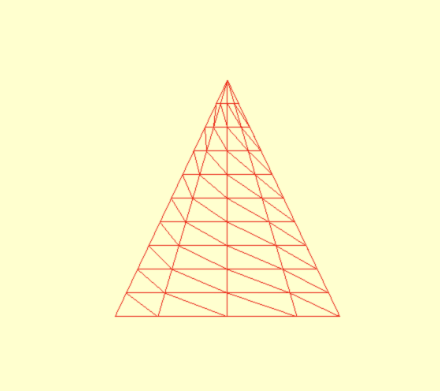

# 导出到 Blender

现在你已将 Blender 全部设置好，是时候将模型从你的 Playground 导出到 Blender 了。&#x20;

➤ 仍在“Render and Export 3D Model”中，在你创建网格的 Playground 顶部附近，将：

```swift
let mdlMesh = MDLMesh(
    sphereWithExtent: [0.75, 0.75, 0.75],
    segments: [100, 100],
    inwardNormals: false,
    geometryType: .triangles,
    allocator: allocator)
```

替换为：

```swift
let mdlMesh = MDLMesh(
    coneWithExtent: [1, 1, 1],
    segments: [10, 10],
    inwardNormals: false,
    cap: true,
    geometryType: .triangles,
    allocator: allocator)
```

➤ 此代码将生成一个原始锥体网格来代替球体。运行 Playground，你将看到线框锥体。

<figure><figcaption></figcaption></figure>

这是你将使用 Model I/O 导出的模型。

➤ 打开 Finder，在 Documents 文件夹中，创建一个名为 Shared Playground Data 的新目录。你从 Playground 保存的所有文件都将在此处保存，因此请确保正确命名。

> 注意：全局常量 `PlaygroundSharedDataDirectory` 保存此文件夹名称。

➤ 要导出锥体，请在创建网格后立即添加此代码：

```swift
// begin export code
// 1
let asset = MDLAsset()
asset.add(mdlMesh)
// 2
let fileExtension = "usda"
guard MDLAsset.canExportFileExtension(fileExtension) else {
    fatalError("Can't export a .\(fileExtension) format")
}
// 3
do {
    let url = playgroundSharedDataDirectory
      .appendingPathComponent("primitive.\(fileExtension)")
    try asset.export(to: url)
} catch {
    fatalError("Error \(error.localizedDescription)")
}
// end export code
```

让我们仔细看看代码：

1. Model I/O 中场景的顶层是 `MDLAsset`。你可以通过向资源添加网格、相机和灯光等子对象来构建完整的场景层次结构。
2. 检查 Model I/O 是否可以导出 .usda 文件类型。你通常会选择 .usd 或 .usdz，但在此处选择 ASCII 文本格式将允许你检查文件的内容。
3. 将锥体导出到存储在 Shared Playground Data 中的目录。

➤ 运行 Playground 以导出锥体对象。

> 注意：如果 Playground 崩溃，可能是因为你没有在 Documents 中创建 Shared Playground Data 目录。
