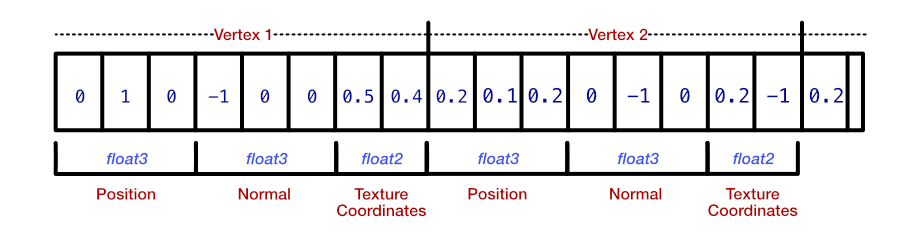

# 顶点描述(Vertex Descriptors)

Metal 使用描述符作为创建对象的通用模式。你在上一章中设置管道描述符来描述管道状态时看到了这种模式。在加载模型之前，你通过创建顶点描述符来告诉 Metal 如何布置顶点和其他数据。

下图描述了模型顶点数据的传入缓冲区。它有两个顶点，具有位置、法线和纹理坐标属性。顶点描述符告知 Metal 你希望如何查看这些数据。

<figure><figcaption></figcaption></figure>

➤ 在刚刚添加的代码下方添加此代码：

```swift
// 1
let vertexDescriptor = MTLVertexDescriptor()
// 2
vertexDescriptor.attributes[0].format = .float3
// 3
vertexDescriptor.attributes[0].offset = 0
// 4
vertexDescriptor.attributes[0].bufferIndex = 0
```

仔细观察：

1. 你创建一个顶点描述符，将使用它来配置对象需要了解的所有属性。

> 注意：你可以使用相同的值或重新配置的值重复使用此顶点描述符来实例化不同的模型对象。

2. USD 文件包含法线和纹理坐标数据以及顶点位置数据。目前，你不需要表面法线或纹理坐标；你只需要位置。你告诉描述符，xyz 位置数据应作为 float3 加载，这是一种由三个 Float 值组成的 simd 数据类型。`MTLVertexDescriptor` 具有 31 个属性的数组，你可以在其中配置数据格式。在后面的章节中，你将加载法线和纹理坐标属性。
3. 偏移量指定此特定数据在缓冲区中的起始位置。
4. 当你通过渲染编码器将顶点数据发送到 GPU 时，你会将其发送到 `MTLBuffer` 中并通过索引标识缓冲区。有 31 个可用缓冲区，Metal 在缓冲区参数表中跟踪它们。你在此处使用缓冲区 0，以便顶点着色器函数能够将缓冲区 0 中的传入顶点数据与此顶点布局进行匹配。

➤ 现在在前面几行下方添加此代码：

```swift
// 1
vertexDescriptor.layouts[0].stride =
    MemoryLayout<SIMD3<Float>>.stride
// 2
let meshDescriptor =
    MTKModelIOVertexDescriptorFromMetal(vertexDescriptor)
// 3
(meshDescriptor.attributes[0] as! MDLVertexAttribute).name =
    MDLVertexAttributePosition
```

检查所有内容：

1. 在这里，你指定缓冲区 0 的步幅。步幅是每组顶点信息之间的字节数。回顾上一个描述位置、法线和纹理坐标信息的图表，每个顶点之间的步幅将是 float3 + float3 + float2。但是，在这里你只加载位置数据，因此要到达下一个位置，你需要跳过 float3 的步幅。SIMD3 类型是 Swift 中与 float3 等效的类型。稍后，你将使用 float3 的类型别名。

使用缓冲区布局索引和步幅格式，你可以设置引用具有不同布局的多个 `MTLBuffer` 的复杂顶点描述符。你可以选择交错位置、法线和纹理坐标；或者你可以先布局一个包含所有位置数据的缓冲区，然后再布局其他数据。

2. Model I/O 需要稍微不同格式的顶点描述符，因此你需要从 Metal 顶点描述符创建新的 Model I/O 描述符。如果你有一个 Model I/O 描述符并且需要一个 Metal 描述符，`MTKMetalVertexDescriptorFromModelIO()` 可以为你提供解决方案。
3. 为属性分配一个字符串名称“position”。这会告诉 Model I/O 这是位置数据。法线和纹理坐标数据也可用，但使用此顶点描述符，你告诉 Model I/O 你不想加载这些属性。

➤ 继续添加此代码：

```swift
let asset = MDLAsset(
    url: assetURL,
    vertexDescriptor: meshDescriptor,
    bufferAllocator: allocator)
let mdlMesh =
    asset.childObjects(of: MDLMesh.self).first as! MDLMesh
```

此代码使用 URL、顶点描述符和内存分配器读取资产。然后，你读取资产中的第一个 Model I/O 网格缓冲区。一些更复杂的对象将有多个网格，但你稍后会处理。

现在你已经加载了模型顶点信息，其余代码将相同，并且你的 Playground 将从新的 mdlMesh 变量加载网格。

➤ 运行 Playground 以查看火车的线框。

<figure><figcaption></figcaption></figure>

嗯，这不太好。火车车轮离地面太高了。另外，火车的其余部分也丢失了！是时候解决这些问题了，从火车的车轮开始。

