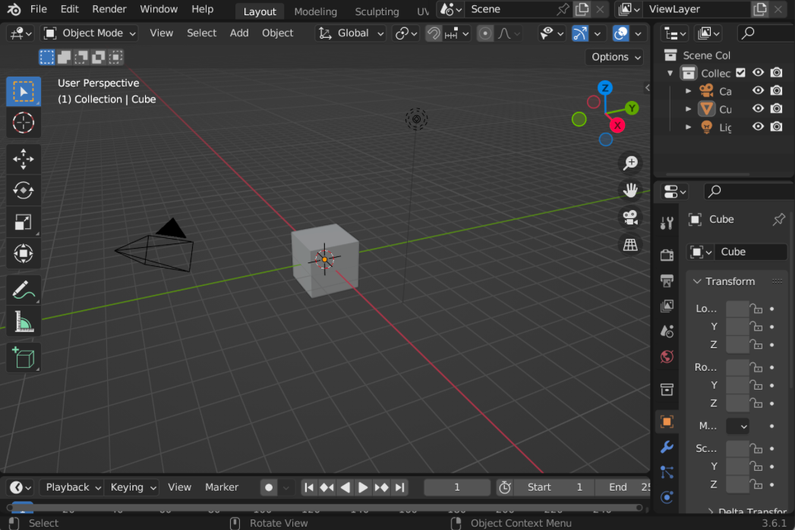

# 使用 Blender 创建模型

要创建 3D 模型，你需要一个 3D 建模应用程序。这些应用程序从免费到非常昂贵不等。许多专业人士使用 Blender，但如果你更熟悉其他 3D 应用程序，例如 Cheetah3D、Maya 或 Houdini，那么欢迎你使用它，它们的概念是相同的。

➤ 从 https://www.blender.org 下载并安装 Blender。

➤ 启动 Blender。单击启动画面外部以将其关闭，你将看到类似于此的界面：

<figure><figcaption></figcaption></figure>

你的界面可能看起来不同。但是，如果你希望 Blender 界面看起来像此处显示的图像，请选择 Edit ▸ Preferences…。单击左下角的 Hamburger menu，选择 Load Factory Preferences，然后单击弹出窗口 Load Factory Preferences，该窗口将显示在光标下方。单击 Save Preferences 以保留这些首选项以供将来的会话使用。

> 注意：如果你想创建自己的模型，可以参考 Blender 教程 (https://bit.ly/3gwKiel)。本教程教你如何制作蘑菇。然后，你可以在本章末尾的操场上渲染蘑菇。
>
> 
