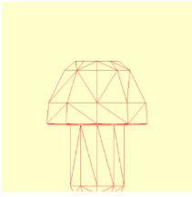

# 挑战

如果你喜欢有趣的挑战，请完成 Blender 教程以制作蘑菇（https://bit.ly/3gwKiel），然后将你在 Blender 中制作的内容导出到 .usdz 文件。如果你想跳过建模，你可以在本章的资源目录中找到 mushroom.usdz 文件。

➤ 将 mushroom.usdz 导入到 Playground 并渲染它。

如果你使用自己建模的蘑菇，你可能会发现蘑菇侧躺着。Blender 使用 Z 轴向上，而你的游乐场期望 Y 轴向上。在导出到 USD 之前，你应该将模型在 Z 轴上旋转 180º，在 X 轴上旋转 270º。然后，你必须在导出之前使用菜单选项 Object ▸ Apply ▸ All Transforms 在 Blender 中应用所有变换。资源目录中的 mushroom.usdz 已经旋转。

<figure><figcaption></figcaption></figure>

如果你遇到困难，完整的 Playground 位于本章的挑战目录中。
