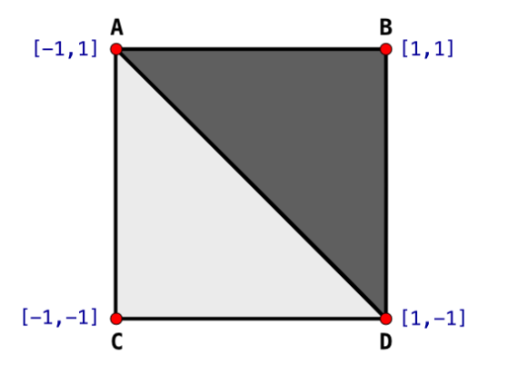
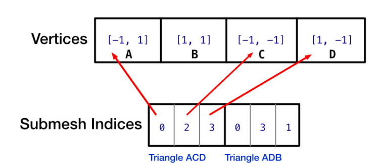
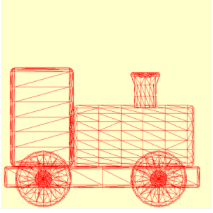

# 子网格(Submeshes)

到目前为止，你的原始球体和圆锥体模型仅包含一个材料组，因此只有一个子网格。这是一个具有四个顶点和两个材料组的平面。

<figure><figcaption></figcaption></figure>

当 Model I/O 加载此平面时，它会将四个顶点放置在 `MTLBuffer` 中。下图显示了顶点位置数据以及两个子网格缓冲区如何索引顶点数据。


<figure><figcaption></figcaption></figure>

第一个子网格缓冲区保存浅色三角形 ACD 的顶点索引。这些索引指向顶点 0、2 和 3。第二个子网格缓冲区保存深色三角形 ADB 的索引。子网格还具有子网格缓冲区开始的偏移量。索引可以保存在 uint16 或 uint32 中。第二个子网格缓冲区的偏移量将是 uint 类型大小的三倍。

### 缠绕顺序(Winding Order)

顶点顺序(也称为缠绕顺序)在这里很重要。此平面的顶点顺序是逆时针的。对于逆时针缠绕顺序，按逆时针顺序定义的三角形面向你。而按顺时针顺序定义的三角形则背对你。在下一节中，你将了解图形管道，你将看到 GPU 可以剔除不面向你的三角形，从而节省宝贵的处理时间。

### 渲染子网格

目前，你只渲染第一个子网格，但由于火车有多个材质组，因此你需要循环遍历子网格来渲染所有子网格。

➤ 在 Playground 的末尾，更改：

```swift
guard let submesh = mesh.submeshes.first else {
   fatalError()
}
renderEncoder.drawIndexedPrimitives(
    type: .triangle,
    indexCount: submesh.indexCount,
    indexType: submesh.indexType,
    indexBuffer: submesh.indexBuffer.buffer,
    indexBufferOffset: 0)
```

为：

```swift
for submesh in mesh.submeshes {
    renderEncoder.drawIndexedPrimitives(
      type: .triangle,
      indexCount: submesh.indexCount,
      indexType: submesh.indexType,
      indexBuffer: submesh.indexBuffer.buffer,
      indexBufferOffset: submesh.indexBuffer.offset
    )
}
```

此代码循环遍历子网格并为每个子网格发出绘制调用。网格和子网格位于 MTLBuffers 中，子网格保存网格中顶点的索引列表。

➤ 运行 Playground，你的火车将完全渲染 - 减去材质颜色，你将在第 11 节“图和材质”中处理这些颜色。

<figure><figcaption></figcaption></figure>

恭喜！你现在正在渲染 3D 模型。现在，不必担心你只在二维中渲染它们或颜色不正确。在下一节之后，你将了解有关渲染内部的更多信息。接下来，你将学习如何将这些顶点移动到第三维。
