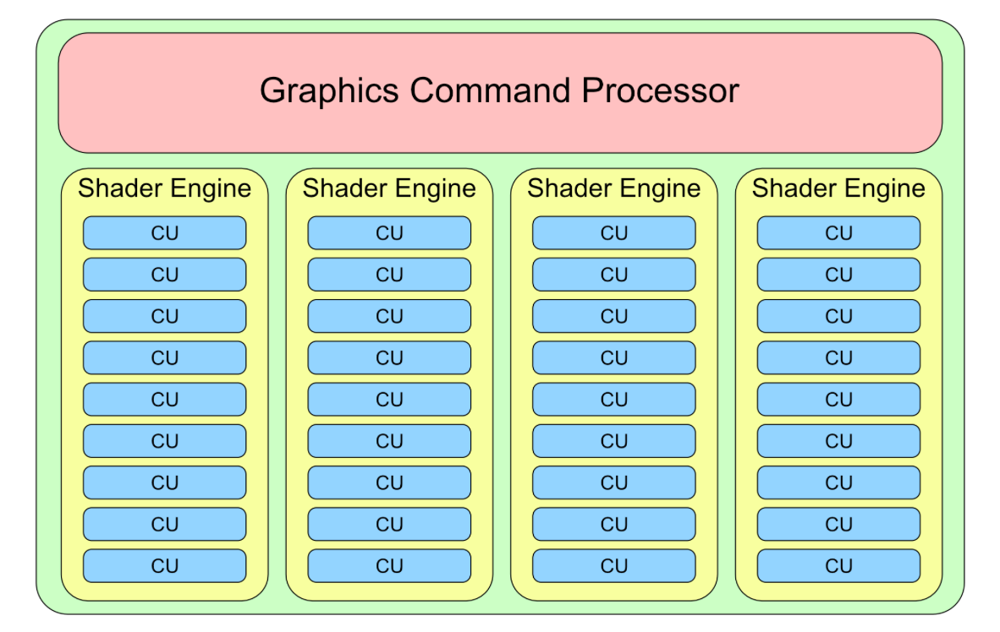
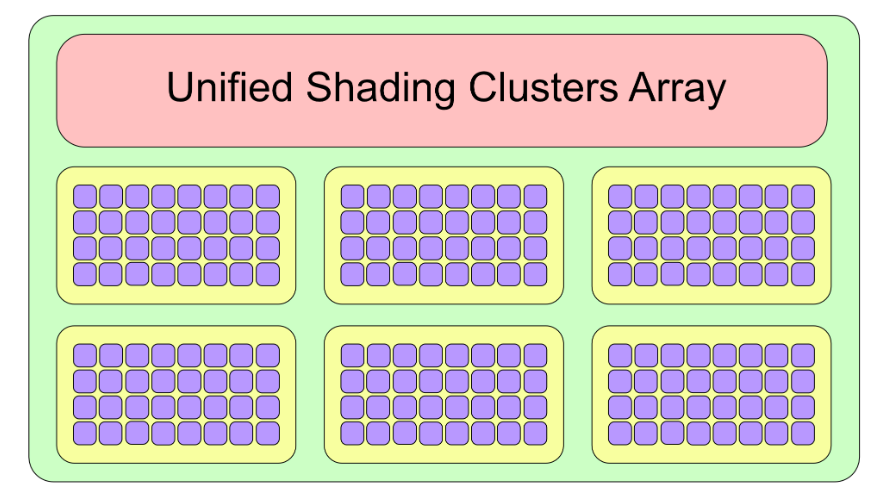

# 2 - 顶点处理(Vertex Processing)

在顶点处理阶段，顶点被单独处理。你编写代码来计算每个顶点的光照和颜色。更重要的是，你将顶点坐标发送到各种坐标空间以到达它们在最终帧缓冲区中的位置。

你在第 1 节“Hello, Metal!”中简要了解了着色器函数和 Metal 着色语言 (MSL)。现在是时候看看硬件层面上发生了什么。

看看这个 AMD GPU 架构图：

<figure><figcaption></figcaption></figure>

从上到下，GPU 具有：

* 1 个图形命令处理器：用于协调工作流程。
* 4 个着色器引擎 (SE)：SE 是 GPU 上的组织单元，可以为整个管道提供服务。每个 SE 都有一个几何处理器、一个光栅化器和计算单元。
* 9 个计算单元 (CU)：CU 只不过是一组着色器核心。
* 64 个着色器核心：着色器核心是 GPU 的基本构建块，所有着色工作都在这里完成。

总共 36 个 CU 有 2,304 个着色器核心。将其与 8 核 CPU 中的核心数量进行比较。

对于移动设备，情况略有不同。为了进行比较，请查看下图，其中显示了与最近的 iOS 设备类似的 GPU。PowerVR GPU 没有 SE 和 CU，而是具有统一着色集群 (USC)。

该特定的 GPU 型号有 6 个 USC，每个 USC 有 32 个核心，总​​共只有 192 个核心。

<figure><figcaption></figcaption></figure>

> 注意：iPhone X 拥有第一款完全由 Apple 内部设计的移动 GPU。Apple 迄今为止尚未公开任何 GPU 硬件规格。

那么，这么多核心可以做什么呢？由于这些核心专门用于顶点和片段着色，因此显而易见的一件事是让所有核心并行工作，以便更快地处理顶点或片段。不过，也有一些规则。

在 CU 中，你只能处理一次顶点或片段。(幸好有 36 个！)另一条规则是，每个 SE 只能处理一个着色器函数。拥有四个 SE 可让你以有趣且有用的方式组合工作。例如，你可以在一个 SE 上运行一个片段着色器，在第二个 SE 上运行第二个片段着色器。或者，你可以将顶点着色器与片段着色器分开，并让它们在不同的 SE 上并行运行。

