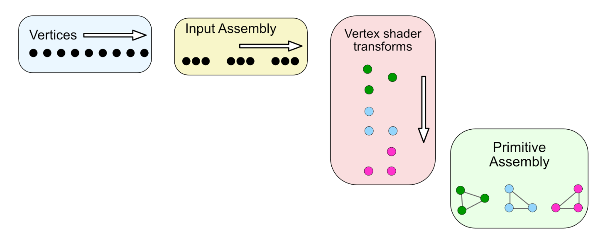
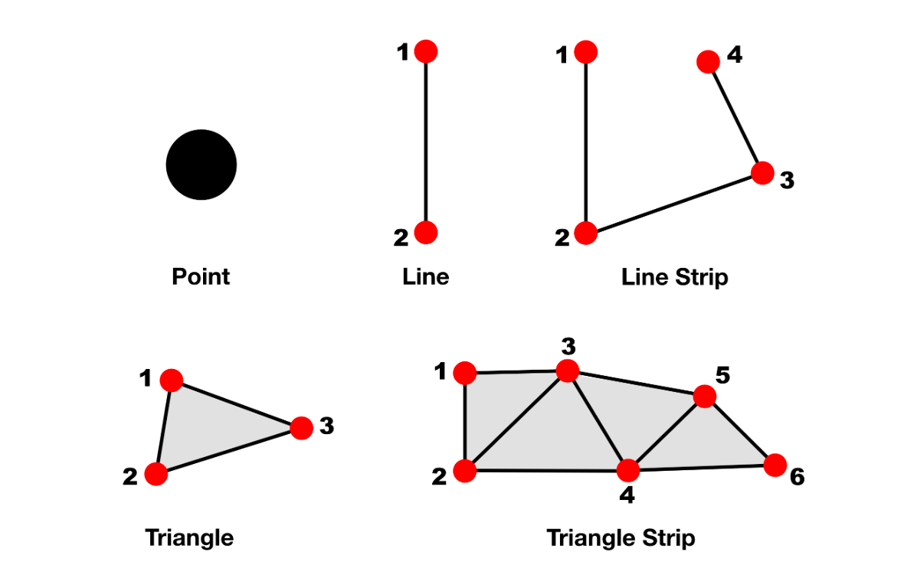
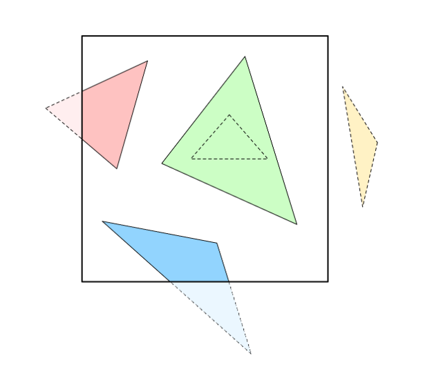

# 3 - 图元组装(Primitive Assembly)

前一阶段将处理过的顶点分组为数据块发送到此阶段。需要记住的重要一点是，属于同一几何形状(图元)的顶点始终位于同一块中。这意味着一个点的一个顶点、一条线的两个顶点或一个三角形的三个顶点将始终位于同一块中，因此无需第二次块提取。

<figure><figcaption></figcaption></figure>

除了顶点之外，CPU 在发出绘制调用命令时还会发送顶点连接信息，如下所示：&#x20;

```swift
renderEncoder.drawIndexedPrimitives(
    type: .triangle,
    indexCount: submesh.indexCount,
    indexType: submesh.indexType,
    indexBuffer: submesh.indexBuffer.buffer,
    indexBufferOffset: 0)
```

绘制函数的第一个参数包含有关顶点连接的最重要信息。在本例中，它告诉 GPU 应该从它发送的顶点缓冲区绘制三角形。

Metal API 提供五种基元类型：

<figure><figcaption></figcaption></figure>

* point：对于每个顶点，栅格化一个点。你可以在顶点着色器中指定具有属性 \[\[point\_size]] 的点的大小。
* line：对于每对顶点，栅格化它们之间的一条线。如果顶点已经包含在一条线中，则不能再次包含在其他线中。如果顶点数量为奇数，则忽略最后一个顶点。
* lineStrip：与简单线相同，不同之处在于线带连接所有相邻顶点并形成折线。每个顶点(第一个顶点除外)都连接到前一个顶点。
* triangle：对于每个三个顶点序列，栅格化一个三角形。如果最后的顶点不能形成另一个三角形，则忽略它们。
* triangleStrip：与简单三角形相同，不同之处在于相邻顶点也可以连接到其他三角形。

还有一种称为 patch 的原始类型，但这需要特殊处理。你将在第 19 节“Tessellation & Terrains”中阅读有关补丁的更多信息。

正如你在上一节中读到的，管道指定了顶点的缠绕顺序。如果缠绕顺序是逆时针的，并且三角形顶点顺序是逆时针的，则顶点是正面的；否则，顶点是背面的，并且可以被剔除，因为你看不到它们的颜色和光照。当图元被其他图元完全遮挡时，它们会被剔除。

但是，如果它们只是部分在屏幕外，它们将被剪裁。

<figure><figcaption></figcaption></figure>

为了提高效率，你应该在管道状态下设置缠绕顺序并启用背面剔除。

此时，图元已从连接的顶点完全组装起来并准备好移至光栅化器(Rasterizer)。

