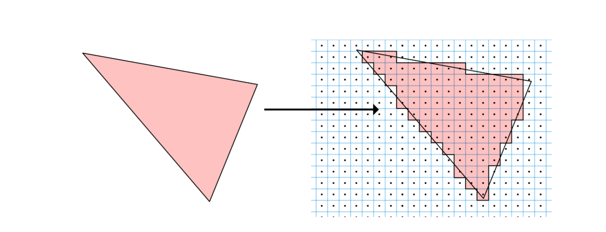

# 4 - 光栅化(Rasterization)

目前有两种现代渲染技术在不同路径上发展，但有时会一起使用：光线追踪和光栅化。它们完全不同，各有利弊。光线追踪(你将在第 27 节“使用光线渲染”中阅读更多内容)是渲染静态和远处内容时的首选，而光栅化是渲染靠近相机且更具动态的内容时的首选。

使用光线追踪，它会将光线发送到屏幕上的每个像素，以查看是否与对象相交。如果是，则将像素颜色更改为该对象的颜色，但前提是该对象比当前像素先前保存的对象更靠近屏幕。

光栅化则相反。对于场景中的每个对象，将光线发送回屏幕并检查哪些像素被该对象覆盖。深度信息的保存方式与光线追踪相同，因此如果当前对象比之前保存的对象更近，它将更新像素颜色。

此时，所有从上一阶段发送的连接顶点都需要使用它们的 X 和 Y 坐标在二维网格上表示。此步骤称为**三角形设置(Triangle setup)**。此时，光栅化器需要计算任意两个顶点之间线段的斜率或陡度。

当知道三个顶点的三个斜率时，就可以由这三个边形成三角形。

接下来，在屏幕的每一行上运行一个称为扫描转换(Scan conversion)的过程，以寻找交点并确定哪些是可见的，哪些是不可见的。此时要在屏幕上绘图，你只需要顶点和它们确定的斜率。

扫描算法确定线段上的所有点或三角形内的所有点是否可见，在这种情况下，三角形将完全填充颜色。

<figure><figcaption></figcaption></figure>

对于移动设备，光栅化利用 PowerVR GPU 的平铺架构，并行光栅化 32x32 平铺网格上的图元。在这种情况下，32 是分配给平铺的屏幕像素数，但这个大小完全符合 USC 中的核心数。

如果一个对象在另一个对象的后面怎么办？光栅化器如何确定要渲染哪个对象？这个隐藏表面移除问题可以通过使用存储的深度信息(早期 Z 测试)来确定每个点是否位于场景中其他点的前面来解决。

光栅化完成后，三个更专业的硬件单元开始工作：

1. 称为 Hierarchical-Z 的缓冲区负责移除被光栅化器标记为剔除的片段。
2. 然后，Z 和模板测试(Stencil Test)单元通过将不可见的片段与深度和模板缓冲区进行比较来移除它们。
3. 最后，插值器(Interpolator)单元获取剩余的可见片段并从组装的三角形属性中生成片段属性。

此时，调度程序(Scheduler)单元再次将工作分派到着色器核心，但这一次是发送用于片段处理(Fragment Processing)的光栅化片段。
