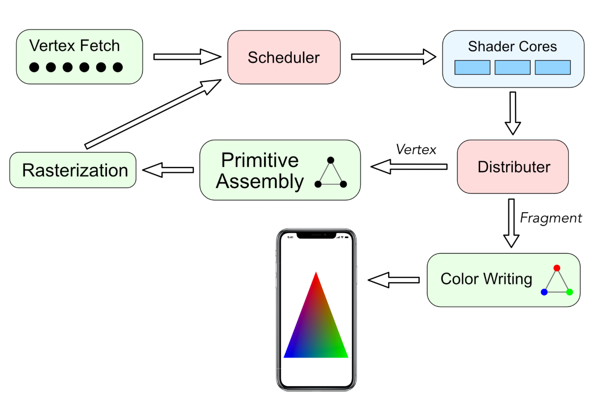
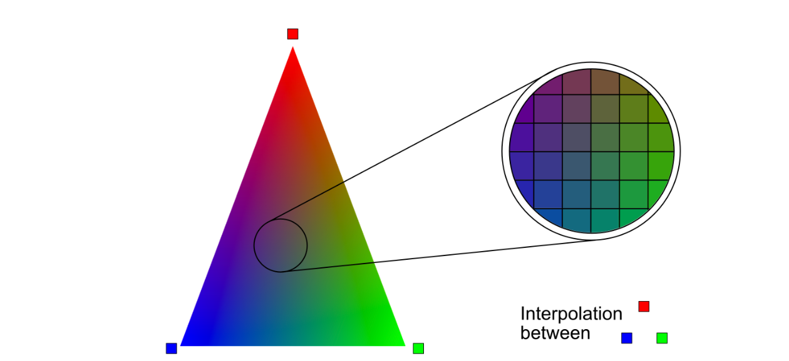

# 5 - 片段处理(Fragment Processing)

现在是快速回顾管道的时间了。

<figure><figcaption></figcaption></figure>

* 顶点提取(Vertex Fetch)单元从内存中抓取顶点并将其传递给调度单元。
* 调度(Scheduler)单元知道哪些着色器核心可用，因此它会在它们上分配工作。
* 工作完成后，分配器(Distributer)单元知道这项工作是顶点处理还是片段处理( Vertex or Fragment Processing)。如果工作是顶点处理，它会将结果发送到基元组装(Primitive Assembly)单元。此路径继续到光栅化(Rasterization)单元，然后返回到调度单元。如果工作是片段处理，它会将结果发送到颜色写入(Color Writing)单元。
* 最后，彩色像素被发送回内存。

前面阶段的基元处理是连续的，因为只有一个基元组装单元和一个光栅化单元。但是，一旦片段到达调度单元，工作就可以分叉(划分)成许多微小的部分，每个部分都分配给一个可用的着色器核心。

数百甚至数千个核心现在正在进行并行处理。当工作完成后，结果将被连接(合并)并再次按顺序发送到内存。

片段处理阶段是另一个可编程阶段。你可以创建一个片段着色器函数，该函数将接收顶点函数输出的光照、纹理坐标、深度和颜色信息。片段着色器输出是该片段的单一颜色。每个片段都会影响帧缓冲区中最终像素的颜色。所有属性都是针对每个片段进行插值的。

<figure><figcaption></figcaption></figure>

例如，要渲染这个三角形，顶点函数将处理三个顶点，颜色分别为红色、绿色和蓝色。如图所示，组成这个三角形的每个片段都是从这三种颜色中插值的。线性插值只是平均两个端点之间线上每个点的颜色。如果一个端点是红色，另一个是绿色，那么它们之间线上的中点将是黄色。依此类推。

插值方程是参数化的，具有以下形式，其中参数 p 是颜色存在的百分比（或从 0 到 1 的范围）：

```swift
newColor = p * oldColor1 + (1 - p) * oldColor2
```

颜色很容易可视化，但其他顶点函数输出也同样针对每个片段进行插值。

> 注意：如果你不希望顶点输出进行插值，请在其定义中添加属性 \[\[flat]]。

### 创建片段着色器(Fragment Shader)

➤ 在 Shaders.Metal 中，将片段函数添加到文件末尾：&#x20;

```swift
fragment float4 fragment_main() {
  return float4(1, 0, 0, 1);
}
```

这是最简单的片段函数。你以 float4 的形式返回插值颜色红色，它以 RGBA 格式描述颜色。组成立方体的所有片段都将是红色。GPU 获取片段并进行一系列后处理测试：

1. alpha 测试(Alpha-testing)根据深度测试确定绘制哪些不透明对象(哪些不绘制)。
2. 对于半透明物体，alpha 混合(Alpha-blending)会将新物体的颜色与之前已保存在颜色缓冲区中的颜色相结合。
3. 剪刀测试(Scissor testing)检查片段是否位于指定矩形内；此测试对于蒙版渲染很有用。
4. 模板测试(Stencil testing)检查存储片段的帧缓冲区中的模板值与我们选择的指定值相比如何。
5. 在前一阶段，我们进行了早期 Z 测试(Early-Z testing)；现在我们进行了晚期 Z 测试(late-Z testing)，以解决更多可见性问题；模板和深度测试对于环境光遮蔽和阴影也很有用。
6. 最后，这里还计算了抗锯齿(Antialiasing)，以便最终显示到屏幕上的图像不会出现锯齿。

你将在第 20 节“片段后期处理”中了解有关后期处理测试的更多信息。
