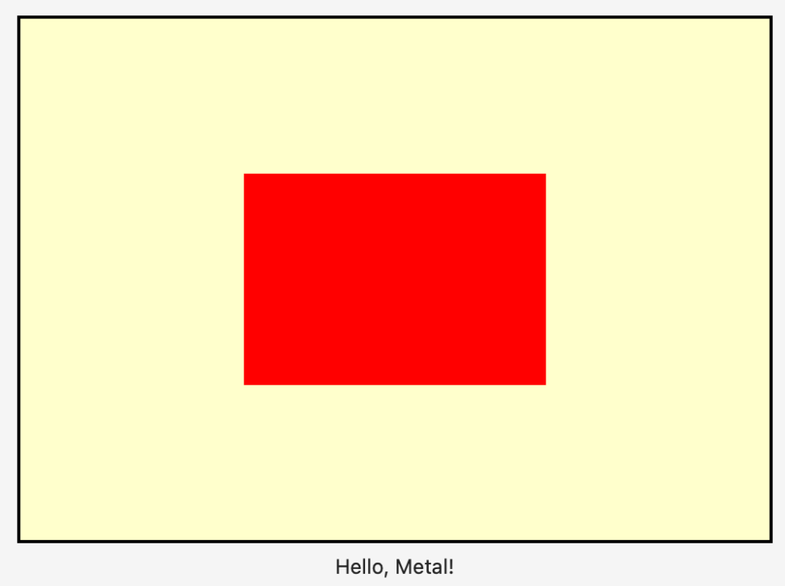

# 6 - 帧缓冲区(Framebuffer)

一旦片段被处理成像素，分配器单元就会将它们发送到颜色写入单元。该单元负责将最终颜色写入称为帧缓冲区的特殊内存位置。从这里开始，视图的彩色像素每帧都会刷新一次。但这是否意味着颜色在屏幕上显示时写入帧缓冲区？

一种称为双缓冲(Double-buffering)的技术可用于解决这种情况。当第一个缓冲区显示在屏幕上时，第二个缓冲区在后台更新。然后，交换两个缓冲区，第二个缓冲区显示在屏幕上，而第一个缓冲区更新，循环继续。

呼！这需要了解很多硬件信息。但是，你编写的代码是每个 Metal 渲染器使用的代码，尽管刚刚开始，但当你查看 Apple 的示例代码时，你应该开始识别渲染过程。

➤ 构建并运行应用程序，你将看到一个精美渲染的红色立方体：

<figure><figcaption></figcaption></figure>

请注意立方体不是正方形。请记住，Metal 使用 X 轴上从 -1 到 1 的标准化设备坐标 (NDC)。调整窗口大小，立方体将保持相对于窗口大小的大小。在第 6 节“坐标空间”中，你将学习如何在屏幕上精确定位对象。

你经历了一段令人难以置信的渲染管道之旅。在下一节中，你将更详细地探索顶点和片段着色器。
